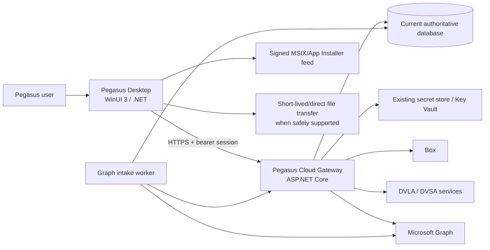
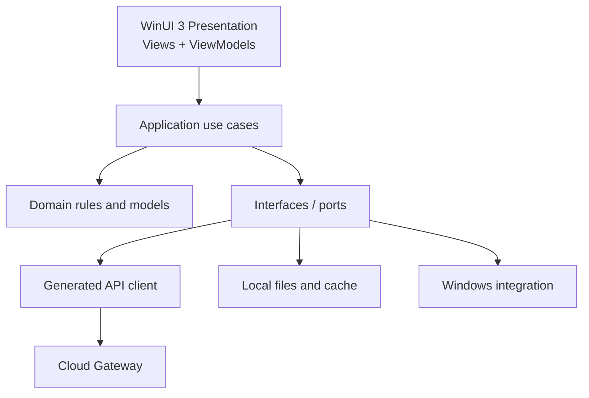
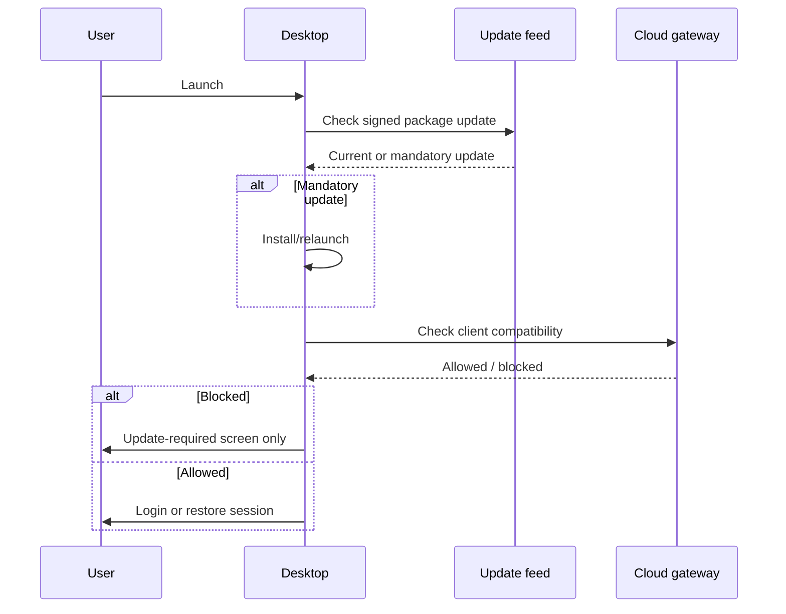

# Pegasus Native Windows Desktop Conversion
## Full target design proposal

**Status:** Proposed target architecture  
**Date:** 23 August 2026  
**Primary decision:** Convert Pegasus into a genuinely native WinUI 3 Windows 11 application, retain only justified central services, and perform the conversion inside a fork or isolated branch of the existing Pegasus repository.

---

## 1. Executive decision

Pegasus should not become a desktop wrapper around the existing website. The recommended target is:

1. A **native WinUI 3 client** containing the presentation layer, interactive workflows, deterministic business rules, local document processing, report generation, view state and most user-triggered orchestration.
2. A **small ASP.NET Core cloud gateway** retaining only responsibilities that genuinely require a central trusted process:
   - authentication against the existing Pegasus account store;
   - authorization and authoritative writes to shared data;
   - controlled access to the central database;
   - server-held credentials and token exchange for Box, Microsoft Graph, DVLA/DVSA and similar services;
   - central audit records;
   - client-version compatibility checks.
3. One or more **existing unattended workers**, principally Microsoft Graph intake/polling, where work must continue while every desktop client is closed.
4. The **current authoritative database and document stores**, because up to ten concurrent users still need a single shared source of truth.
5. A **signed MSIX/App Installer release channel** with a second application-level minimum-version gate, so unsupported clients cannot proceed.

This is a **local-execution, centrally coordinated** design. It is not an offline-first design and it is not an attempt to remove every cloud dependency. The desktop owns work that benefits from running beside the user; the cloud owns shared authority, secrets, callbacks and unattended activity.

### Recommended starting option

Choose **option 1: start from a Pegasus fork or isolated conversion branch**.

However, do not incrementally mutate the web user interface into a desktop user interface. Create the WinUI 3 client as a clean native implementation within the existing repository, while extracting and reusing suitable domain code, contracts, tests and integrations. This is effectively a **greenfield desktop client inside the existing Pegasus codebase**.

A separate greenfield repository would give a cleaner initial tree, but it would create two sources of truth for contracts, database migrations, business rules, CI and feature parity. It is therefore the weaker option under the requirement that the existing Pegasus repository remains authoritative.

---

## 2. Authority and scope

When the inputs disagree, use this order:

1. The requirements in the current desktop-conversion brief.
2. Observable business behaviour and data contracts in the current Pegasus repository.
3. Explicit current business decisions and approved Pegasus tickets.
4. Project architecture decisions recorded during this conversion.
5. The prior documents:
   - *Pegasus Desktop Conversion Plan*;
   - *Desktop Azure Conversion Plan*;
   - *Recommended desktop API architecture*.
6. General guidance from `dotnet/skills`, `microsoft/win-dev-skills` and Microsoft documentation.

The earlier plans are useful research, not constraints. Generic skill guidance is also not a substitute for a project decision. Where an upstream skill assumes a web application, Microsoft-account login, cross-platform runtime, public distribution or enterprise-scale traffic, that guidance is not applicable to Pegasus unless separately justified.

### 2.1 Locked constraints

- WinUI 3 is the presentation technology.
- Windows 11 is the only supported operating system.
- Pegasus is private, in-house software.
- Expected simultaneous users: no more than approximately ten.
- It must not be a WebView/WebView2 shell around the current application.
- Existing Pegasus user accounts and login experience remain; users are not required to sign in with Microsoft accounts.
- Existing Azure resources are not deprovisioned during conversion.
- The current Pegasus repository is retained and may be freely changed.
- Mandatory updates are acceptable; an unsupported client must not be allowed to continue.
- Reverse-engineering resistance and intellectual-property obfuscation are not design priorities.
- Performance, desktop usability, maintainability and operational simplicity are priorities.

### 2.2 Explicit non-goals

The initial desktop conversion should not introduce:

- cross-platform abstractions such as .NET MAUI;
- Electron, Tauri, a browser shell or a hosted web front end;
- microservices;
- Kubernetes;
- event sourcing;
- a general-purpose message bus;
- CQRS infrastructure for its own sake;
- an offline-first replication engine;
- a plugin marketplace;
- multi-tenancy;
- API Management solely for ten internal users;
- Redis or another distributed cache without measured need;
- SignalR solely to make the system appear “real time”;
- a new identity provider where the present account system is adequate;
- a bespoke updater when signed MSIX/App Installer mechanisms can meet the requirement;
- a generic workflow engine merely to reproduce a finite set of Pegasus workflows.

---

## 3. Reconciliation of the earlier desktop proposals

Several ideas commonly included in desktop-conversion proposals should be revised for the current vision.

| Earlier or possible assumption | Decision in this proposal | Reason |
|---|---|---|
| The existing web UI should be displayed in a desktop shell | Rejected | It would preserve web layout, browser state and web performance characteristics rather than create a native application. |
| “Pegasus Core” must remain a large server-side application | Rejected as a default | Deterministic domain and application logic can run in the client. Only central authority, shared state, secrets and unattended activity require a server. |
| A native app should connect directly to the production database | Rejected | Private distribution reduces IP concerns, but it does not remove credential exposure, accidental misuse, authorization bypass, concurrency or schema-coupling risks. |
| Desktop users should authenticate with Microsoft/Entra accounts | Rejected | The existing Pegasus credentials and user model remain. Graph authentication is a separate service-to-service concern. |
| New Azure components are needed because the UI changes | Rejected | A new UI is not itself a reason to add cloud resources. Existing hosting should be reused and reduced where practical. |
| All business processing should be moved to the cloud | Rejected | Interactive validation, calculations, reports and document processing should be local unless a clear cloud requirement exists. |
| All processing should be moved to the desktop | Also rejected | Shared data, unattended mail intake, central credentials and authoritative authorization remain central. |
| Forced updates eliminate the need for any server validation | Rejected | Forced updates reduce version drift but do not resolve concurrent edits, compromised credentials, central revocation or database integrity. |
| Enterprise-scale infrastructure is prudent “for later” | Rejected | Ten users do not justify high-scale infrastructure. Add capacity only when measurements show a need. |
| The current web page structure should dictate desktop navigation | Rejected | Business capabilities and user workflows should be preserved; accidental web layout should not be. |

### 3.1 What “core” means in the target system

The term **Pegasus Core** should no longer imply “the part that must run in Azure.”

Use these definitions instead:

- **Domain:** business concepts, rules and calculations that do not depend on UI, HTTP, Azure or a database.
- **Application:** user-level use cases that coordinate domain operations through interfaces.
- **Desktop presentation:** WinUI 3 windows, pages, controls, view models and local interaction state.
- **Cloud gateway:** the small trusted boundary for authentication, shared persistence, third-party secrets and authoritative writes.
- **Workers:** unattended integration processes.
- **Infrastructure adapters:** implementations for HTTP, Box, Graph, DVLA/DVSA, database access, file storage and logging.

The Domain and most Application code can execute inside the desktop app. The cloud gateway may reference the same assemblies to enforce critical invariants on writes. That is shared source code, not a broad server-side “core.”

---

## 4. The mandatory cloud-justification test

Every cloud-hosted responsibility must answer **yes** to at least one of the following questions:

1. **Shared authority:** Must several users see and update the same authoritative state?
2. **Unattended execution:** Must it continue when all desktops are closed?
3. **Protected credentials:** Does it require a long-lived secret or powerful service credential that should not be placed on workstations?
4. **Public callback:** Must an external service call a stable public endpoint?
5. **Central enforcement:** Must account revocation, permissions, audit or a data invariant be enforced independently of the client?
6. **Measured operational advantage:** Is there measured evidence that central execution is materially more reliable, faster or cheaper than local execution?

If all six answers are **no**, the responsibility belongs in the desktop client.

“Existing code is already in Azure,” “this is how the web app works,” and “it may scale later” are not sufficient justifications.

### 4.1 Placement decisions

| Capability | Desktop responsibility | Cloud responsibility | Decision |
|---|---|---|---|
| Native UI, navigation and state | Entirely local | None | Desktop |
| Form validation and immediate feedback | Local | Recheck critical invariants on write | Mostly desktop |
| Business calculations | Local/shared assemblies | Optional authoritative recheck | Mostly desktop |
| Case workflow commands | Build and validate commands | Authorize, apply transaction, audit | Split |
| Case/query presentation | Render, sort cached page, filter local page | Authoritative server filtering/paging | Split |
| Central case data | Local transient models/cache | Authoritative database | Cloud required |
| User login screen | Native UI | Verify existing credentials, issue/revoke session | Split |
| Microsoft Graph intake/polling | Show status/results | Poll/deduplicate while desktops are closed | Cloud required |
| Box document browsing | Native browser, preview, local cache | Token ownership, metadata authorization, transfer broker | Split |
| DVLA/DVSA lookup | Trigger, display, local validation | Secret/rate-limit handling and shared result cache | Split |
| Interactive report generation | Generate and preview locally | Store final record/document centrally | Mostly desktop |
| Scheduled report or email work | Display/configure | Run while app closed | Cloud required only when scheduled |
| File preview and temporary working copy | Local | Canonical Box/storage copy | Split |
| Update installation | MSIX/App Installer on device | Signed package and version manifest hosting | Split |
| Audit trail | Display locally | Authoritative append-only record | Cloud required |
| Telemetry | Local structured log and diagnostic export | Optional central ingestion | Optional cloud |
| User preferences | Local device preferences | Only roam preferences that genuinely need sharing | Mostly desktop |
| Notifications | In-app polling/refresh | Store shared notification state | Split; no SignalR initially |
| OCR/image preprocessing invoked by user | Local where hardware permits | Only where a central model/service is explicitly required | Desktop by default |

---

## 5. Target system architecture

### 5.1 Logical context



### 5.2 Deployment units

The target should contain only two application deployables in Azure unless the current implementation already has a justified additional worker:

1. **Pegasus Cloud Gateway**
   - ASP.NET Core;
   - authentication and session endpoints;
   - role/permission checks;
   - central data query and command endpoints;
   - Box/DVLA/DVSA/Graph user-triggered integration adapters;
   - client compatibility endpoint;
   - health and diagnostics endpoints.

2. **Pegasus Intake Worker**
   - existing Microsoft Graph polling or notification handling;
   - deduplication;
   - intake parsing/orchestration that must run unattended;
   - durable checkpoint/lease;
   - retry and failure visibility.

The current database, Box tenancy, Graph tenancy, secret store, update package storage and existing monitoring are dependencies, not separate Pegasus application services.

The gateway and worker may physically share an existing Azure hosting plan. They should remain logically separate because an intake loop should not be allowed to degrade interactive API responsiveness. They do not require separate microservices, separate data models or a service mesh.

### 5.3 Native desktop layers



The dependency direction is inward:

- `Pegasus.Domain` depends on no Pegasus infrastructure and no WinUI.
- `Pegasus.Application` depends on Domain and small abstractions.
- `Pegasus.Desktop` depends on Application, WinUI 3 and desktop infrastructure.
- `Pegasus.Cloud.Api` depends on Application/Domain plus server infrastructure.
- Desktop projects must not reference Entity Framework database contexts, Azure SDK credentials or server integration implementations.

### 5.4 Recommended solution structure

Use the current repository and evolve its solution toward this shape:

```text
/
├─ src/
│  ├─ Pegasus.Domain/
│  │  ├─ Cases/
│  │  ├─ Vehicles/
│  │  ├─ Assessments/
│  │  ├─ Documents/
│  │  └─ Common/
│  ├─ Pegasus.Application/
│  │  ├─ Cases/
│  │  ├─ Intake/
│  │  ├─ Documents/
│  │  ├─ Vehicles/
│  │  ├─ Reports/
│  │  └─ Abstractions/
│  ├─ Pegasus.Contracts/
│  │  ├─ Requests/
│  │  ├─ Responses/
│  │  ├─ Events/
│  │  └─ ProblemDetails/
│  ├─ Pegasus.Desktop/
│  │  ├─ App.xaml
│  │  ├─ Shell/
│  │  ├─ Features/
│  │  ├─ Controls/
│  │  ├─ Styles/
│  │  ├─ Services/
│  │  └─ Assets/
│  ├─ Pegasus.Desktop.Infrastructure/
│  │  ├─ Api/
│  │  ├─ Authentication/
│  │  ├─ Caching/
│  │  ├─ Documents/
│  │  ├─ Diagnostics/
│  │  └─ Windows/
│  ├─ Pegasus.Cloud.Api/
│  │  ├─ Features/
│  │  ├─ Authentication/
│  │  ├─ Persistence/
│  │  ├─ Integrations/
│  │  └─ Compatibility/
│  ├─ Pegasus.Cloud.IntakeWorker/
│  └─ Pegasus.Database/
├─ tests/
│  ├─ Pegasus.Domain.Tests/
│  ├─ Pegasus.Application.Tests/
│  ├─ Pegasus.Api.ContractTests/
│  ├─ Pegasus.Api.IntegrationTests/
│  ├─ Pegasus.Desktop.ViewModelTests/
│  ├─ Pegasus.Desktop.UITests/
│  ├─ Pegasus.Packaging.Tests/
│  └─ Pegasus.EndToEnd.Tests/
├─ docs/
│  ├─ architecture/
│  ├─ decisions/
│  ├─ features/
│  ├─ ui/
│  ├─ api/
│  ├─ testing/
│  ├─ operations/
│  └─ agent/
├─ eng/
│  ├─ build/
│  ├─ packaging/
│  ├─ skills/
│  └─ verification/
└─ .agents/
   └─ skills/
      ├─ project/
      └─ vendor/
```

Do not split every feature into a separate assembly. The projects above are boundary projects; feature folders keep related code together. For this system size, a modular monolith is more maintainable than dozens of small projects.

---

## 6. Repository strategy: fork/refactor versus greenfield repository

### 6.1 Option 1 — fork or isolated branch of Pegasus

**Advantages**

- Retains commit history and architectural context.
- Reuses current data models, migrations, authentication, API contracts and tests.
- Allows repository-wide changes to move domain code into shared assemblies.
- Makes feature-parity comparisons traceable.
- Avoids duplicating CI, dependency management and release conventions.
- Supports a controlled “strangler” conversion: replace one complete workflow at a time.
- Keeps the current web application available as a behavioural reference until cutover.

**Risks**

- Existing web concerns may leak into the native design.
- Agents may be tempted to preserve weak boundaries merely because they exist.
- Large restructuring commits can become difficult to review.
- Current tests may validate implementation details rather than business behaviour.

**Controls**

- Create new native projects rather than translating page components line by line.
- Establish dependency rules before feature work.
- Add characterization tests before moving logic.
- Use small vertical-slice changes.
- Record deliberate deviations from the old implementation in ADRs and the parity matrix.

### 6.2 Option 2 — separate greenfield repository

**Advantages**

- Clean project structure from day one.
- No accidental compile-time dependency on the web implementation.
- Easier to enforce a native-only dependency policy.

**Risks**

- Duplicated domain rules and DTOs.
- Separate database migration history.
- Contract drift between old and new applications.
- More difficult feature-parity evidence.
- Greater chance that obscure but important workflows are omitted.
- Two CI/release ecosystems.
- More expensive cutover and rollback.
- Eventually requires merging or abandoning one repository despite the requirement that Pegasus remains authoritative.

### 6.3 Decision

Use option 1.

Prefer a protected `desktop-conversion` branch in the existing repository where governance permits. Use a fork when isolation from production automation or AI-agent permissions is necessary. In either case:

- the desktop client is a clean implementation;
- the current web projects remain temporarily;
- domain and application code are extracted rather than copied;
- the web front end is removed only after parity and cutover;
- no permanent second Pegasus repository is created.

---

## 7. Desktop technology baseline

### 7.1 Runtime

- **.NET 10 LTS** should be the target unless a repository dependency demonstrably blocks it.
- Use the latest **stable**, non-preview Windows App SDK release approved at implementation kickoff and pin it centrally.
- Target **Windows 11 x64** initially.
- Produce a **self-contained, signed MSIX package**.
- Keep the target framework, Windows SDK version and Windows App SDK package versions in central build properties.
- Do not enable Native AOT or aggressive trimming initially. WinUI, reflection-based libraries and serializers can make trimming fragile; startup should be profiled before adding that complexity.
- ReadyToRun may be evaluated only after measuring package-size and startup trade-offs.

.NET 8 should not be selected for a new conversion merely to avoid an upgrade, because its support window is near its end in late 2026. If the existing solution is still on .NET 8, upgrade work belongs in the foundation phase, with compatibility tests before desktop feature work.

### 7.2 Application composition

Use:

- WinUI 3 XAML for all primary screens;
- CommunityToolkit.Mvvm for observable state and commands;
- Microsoft.Extensions.Hosting for dependency injection, configuration, logging and lifetime composition;
- `IHttpClientFactory` and a generated typed client for the gateway;
- `System.Text.Json` for contracts unless the current API requires another serializer;
- structured `Microsoft.Extensions.Logging`;
- Windows App SDK lifecycle APIs for activation and single-instance handling;
- Windows Credential Locker or an equivalent DPAPI-backed store for refresh tokens;
- MSIX/App Installer for package deployment and update.

Avoid adding a large desktop framework on top of WinUI. A shell service, navigation service, dialog service and a small set of project controls are sufficient.

### 7.3 Single-instance behaviour

Pegasus should be single-instance per Windows user:

- a second launch activates the existing window;
- deep links or file activations are redirected to the active process;
- the existing process navigates to the requested case or document;
- unsaved work is not duplicated across multiple processes.

Multi-window support should be limited to a deliberate “open case in new window” capability if users demonstrate a need. It should not be part of the first conversion foundation.

---

## 8. Authentication and authorization

### 8.1 User experience

The login screen remains a Pegasus login:

- username/email and password as currently supported;
- the same account store;
- the same role and permission semantics;
- the same administrative account lifecycle;
- no Microsoft-account prompt;
- no dependency on the workstation’s Windows identity.

Graph or Box may use Microsoft/Box service credentials behind the gateway. Those credentials are implementation details and must not change how users sign into Pegasus.

### 8.2 Protocol

Where the web application currently uses cookies, add or adapt a desktop-compatible session endpoint without changing user credentials:

1. Desktop posts credentials over TLS.
2. Gateway verifies them through the existing identity implementation.
3. Gateway returns a short-lived access token and a rotated refresh token or equivalent session handle.
4. Desktop keeps the access token in memory.
5. Desktop stores only the refresh token/session handle in the Windows credential store.
6. Gateway supports logout, account disablement, refresh revocation and password-change invalidation.
7. Every request carries a client version and correlation identifier.

Do not store the user’s password. Do not place a global service account or database password in desktop configuration.

### 8.3 Authorization

- The desktop may hide or disable unavailable commands for usability.
- The gateway must independently enforce authorization for every data query and command.
- Authorization policies should map to existing Pegasus roles and claims rather than create a new enterprise policy engine.
- Administrative actions require explicit server-side audit records.
- A disabled account must stop working without waiting for a desktop update.

### 8.4 Session failure handling

The desktop must distinguish:

- expired access token: refresh silently;
- revoked/invalid refresh token: return to login;
- account disabled: explain that access has been disabled;
- server unreachable: show connectivity state without presenting it as invalid credentials;
- mandatory version mismatch: update before login or further use;
- password reset required: route to the current supported reset process.

---

## 9. Forced updates and compatibility

Forced updates make it reasonable to place substantially more application logic in the desktop, but the update path becomes critical infrastructure.

### 9.1 Two-layer enforcement

Use two compatible mechanisms:

1. **MSIX/App Installer launch update**
   - signed package;
   - update check on launch;
   - activation blocked where the supported App Installer schema permits;
   - production and pilot channels;
   - downgrade/rollback policy explicitly defined.

2. **Gateway minimum-version gate**
   - unauthenticated or pre-session `client-compatibility` endpoint;
   - returns minimum allowed version, current version, package channel and maintenance information;
   - every authenticated request also includes the client version;
   - unsupported clients receive a specific problem response and cannot perform work.

The application-level gate protects against App Installer configuration failures and allows the API to reject a version with a serious defect. The package mechanism performs the actual trusted installation.

### 9.2 Startup sequence



### 9.3 Operational controls

- Keep the previous known-good package available.
- Deploy backward-compatible API changes before the corresponding desktop version.
- Use expand-and-contract database migrations.
- Pilot every mandatory version with one or two internal users.
- Test interrupted updates, invalid signatures, unavailable feed, insufficient disk, locked files and rollback.
- Maintain an emergency release path; do not rely on a secret bypass that permits an unsupported client to continue indefinitely.
- The signed compatibility response should be cached only for a short, defined period. Because the requirement is fail-closed for obsolete clients, prolonged inability to check compatibility should eventually prevent work rather than allow indefinite offline use.

---

## 10. API and data architecture

### 10.1 Why retain an API

A desktop-to-database connection is technically possible for ten trusted users, but it is not the best design.

An API remains justified because it:

- keeps database and third-party service credentials out of workstations;
- preserves the current account model;
- enforces permissions even if a workstation is misconfigured;
- provides a stable contract while the database schema evolves;
- coordinates concurrent edits;
- creates an authoritative audit trail;
- centralizes idempotency and deduplication;
- prevents every desktop installation from implementing third-party token renewal;
- provides one place to disable a dangerous client version.

This is not an enterprise “API layer for its own sake.” It is the minimum trusted boundary for a multi-user system.

### 10.2 API style

Use one versioned REST API with OpenAPI:

- feature-based route groups;
- typed request and response contracts;
- standard problem responses;
- server-side filtering, sorting and paging;
- cancellation support;
- idempotency keys for actions that must not be duplicated;
- optimistic concurrency tokens;
- correlation identifiers;
- explicit commands for workflow transitions.

Examples:

```text
POST   /api/session/login
POST   /api/session/refresh
POST   /api/session/logout
GET    /api/client-compatibility

GET    /api/cases
POST   /api/cases
GET    /api/cases/{id}
PUT    /api/cases/{id}
POST   /api/cases/{id}/assign
POST   /api/cases/{id}/change-status

GET    /api/cases/{id}/documents
POST   /api/cases/{id}/documents/upload-session
POST   /api/cases/{id}/reports

GET    /api/vehicles/{registration}/lookup
GET    /api/integrations/status
GET    /api/admin/users
```

These are illustrative route shapes, not permission to rename current stable endpoints without need.

Do not expose a generic “execute action” endpoint, generic repository endpoint or database-shaped CRUD API. Workflow-changing operations should be explicit and auditable.

### 10.3 Generated client

- Treat the OpenAPI document as a build artifact and contract.
- Generate the desktop API client during a controlled build step.
- Commit either the generated client or its deterministic generation inputs according to current repository practice; do not regenerate unpredictably on every developer machine.
- Add a contract snapshot test.
- Prevent handwritten duplicate DTOs.
- Apply timeouts and retry only to operations that are safe to repeat.
- Do not retry validation failures, authentication failures or non-idempotent commands blindly.

### 10.4 Concurrency

With up to ten users, optimistic concurrency is sufficient:

- every mutable aggregate returned by the API includes a row version or ETag;
- the client sends that token on update;
- a conflict returns the current server version;
- the desktop offers reload, compare and deliberate reapply where appropriate;
- status changes, assignments and document finalization are transactional;
- do not silently overwrite another user’s work.

No distributed locking service is required.

### 10.5 Transactions and audit

The server transaction should:

1. authenticate and authorize;
2. validate the concurrency token;
3. validate authoritative invariants;
4. apply the data change;
5. write the audit record;
6. write an outbox/work item only if a reliable asynchronous side effect is necessary;
7. commit once;
8. return the new version.

A full event-sourced model is unnecessary. A conventional audit table and, where required, a small database-backed outbox are adequate.

### 10.6 Query strategy

- Lists use server paging/filtering/sorting.
- The desktop may locally sort/filter an already loaded page for instant interaction.
- Large images and documents are not embedded in list responses.
- Case detail is loaded in sections so the first useful view appears quickly.
- Reference data with low change frequency may be memory-cached.
- Cache invalidation uses short lifetimes and explicit refresh after writes, not a distributed cache.

---

## 11. Local state and offline behaviour

Pegasus should be **online-required**, not offline-first.

### 11.1 What may be cached locally

- access token in memory;
- refresh/session token in the Windows credential store;
- window position, theme, grid columns and local preferences;
- small reference-data snapshots;
- thumbnails;
- temporary document working copies;
- optionally, encrypted drafts for selected long forms;
- the last signed compatibility response for a short period;
- rolling redacted diagnostic logs.

### 11.2 What should not become a local database initially

Do not create a full replicated case database or synchronization engine merely to make the app “desktop-like.” It would introduce:

- conflict resolution;
- stale authorization;
- sensitive data persistence;
- migration of two databases;
- complex error recovery;
- difficult testing;
- uncertainty over the authoritative copy.

Add SQLite or a comparable durable cache only after profiling demonstrates that server queries and memory caching cannot meet the performance target.

### 11.3 Connectivity handling

When connectivity is lost:

- existing on-screen data remains visible where safe;
- new authoritative saves are disabled or queued only as an explicit draft, not silently as a server command;
- the status area clearly says that Pegasus is disconnected;
- the app automatically rechecks connectivity;
- no action is presented as complete until the server confirms it;
- temporary files are retained safely and offered for retry;
- logout and token clearing remain available.

---

## 12. Integration design

### 12.1 Microsoft Graph intake

Graph polling or notifications remain cloud-based because intake must continue when desktops are closed and because duplicate pollers on ten machines would be unreliable.

Recommended design:

- retain the existing worker and credentials initially;
- one durable checkpoint per mailbox/source;
- a database lease prevents duplicate active pollers;
- message and attachment identifiers are deduplicated;
- parsing failures enter a visible retry/failure table;
- retries use bounded exponential backoff and respect Graph throttling;
- the desktop shows ingestion status and failures through the gateway;
- no new Service Bus is required unless the existing pipeline relies on one for proven reliability;
- polling may later be replaced by Graph change notifications only if the operational benefit justifies a public callback and subscription-renewal logic.

Graph’s Microsoft identity is service-to-service. It must not force Pegasus users to adopt Microsoft login.

### 12.2 Box

Box remains the canonical document integration where it is already part of Pegasus.

Responsibilities:

**Desktop**
- browse case documents;
- upload by drag-and-drop/file picker;
- preview supported formats;
- maintain a bounded local working cache;
- show transfer progress and cancellation;
- launch an external editor only through an explicit user action;
- detect and communicate conflicting document versions.

**Gateway**
- hold or broker organizational Box credentials;
- enforce that a Pegasus user may access the requested case/document;
- map Pegasus records to Box object identifiers;
- create upload/download sessions;
- record canonical metadata and audit;
- refresh service tokens.

For performance, file bytes should travel directly between the desktop and Box when the current Box authentication model can issue a suitably short-lived, constrained transfer URL. Otherwise, stream through the gateway. Do not place a long-lived Box service token in the desktop merely to avoid gateway bandwidth.

### 12.3 DVLA/DVSA

Keep lookup credentials and rate-limit coordination behind the gateway:

- desktop normalizes and validates the registration input;
- gateway performs the authoritative call;
- response is mapped into Pegasus-owned contracts;
- raw provider response is retained only where legally and operationally justified;
- results use a defined central cache lifetime;
- provider failures are distinguishable from “vehicle not found”;
- every provider call has a correlation identifier;
- client code does not depend directly on provider-specific JSON.

A direct desktop call is acceptable only if the relevant API is explicitly designed for public/native clients and requires no privileged secret. That should be proven from the provider contract rather than assumed.

### 12.4 Email sending and other service actions

Where Pegasus sends mail through Graph or another shared mailbox:

- desktop creates and confirms the command;
- gateway authorizes and queues/executes it;
- service credential remains central;
- duplicate sends are prevented by an idempotency key;
- the final provider message identifier and status are audited.

### 12.5 Documents, PDFs and reports

Interactive report generation should move to the desktop when technically compatible:

- business report model is produced by Application/Domain code;
- native desktop renders the document;
- user previews it locally;
- deterministic tests compare key text, values and layout against approved fixtures;
- final output is uploaded to the canonical store and registered through the gateway.

Do not retain server-side HTML rendering solely because the former UI was web-based. HTML may remain an internal document-template format only if it is the most reliable renderer; it must not turn the application into a web wrapper.

Unattended scheduled generation remains cloud-based only for the specific scheduled workflow.

### 12.6 OCR, image analysis and future AI

Default user-invoked preprocessing to the desktop when it can run reliably on the Windows 11 fleet. Keep remote AI/model calls behind an interface so local and cloud implementations can be selected per capability.

The desktop conversion must not silently introduce an expensive cloud AI dependency. Each AI feature needs its own accuracy, privacy, cost, latency and fallback decision.

---

## 13. Current and desired Pegasus functionality

The conversion must be driven by a repository-derived feature-parity matrix, not by page count. The following capability groups form the target inventory and must be reconciled with exact routes, controllers, services, entities and existing tickets during Phase 0.

### 13.1 Access and session

- Pegasus username/password login;
- session restoration and expiry;
- logout;
- role/permission-aware navigation;
- account disablement and password lifecycle;
- server and integration availability status;
- mandatory update gate.

### 13.2 Dashboard and work queues

- assigned work;
- unassigned/new intake;
- status and age indicators;
- due/overdue items;
- recent cases;
- integration failures needing attention;
- saved filters where current behaviour supports them;
- direct navigation into the relevant case section.

### 13.3 Case lifecycle

- create, view, edit and search cases;
- reference identifiers;
- status transitions;
- assignment;
- dates, priorities and notes;
- duplicate detection;
- provider/principal/client linkage;
- validation and incomplete-data indicators;
- concurrent-edit handling;
- history and audit.

### 13.4 Intake

- manual intake;
- Graph/shared-mailbox intake;
- attachment association;
- parse-before-triage where approved;
- deduplication;
- provider matching and case resolution where currently implemented;
- failed-intake review and retry;
- traceability from source communication to case.

### 13.5 Vehicle and inspection information

- vehicle registration and identifying data;
- DVLA/DVSA/MOT lookups;
- mileage and relevant history;
- inspection address and appointment information;
- engineer allocation;
- roadworthiness/damage/assessment fields where part of the current model;
- source and timestamp of external data.

### 13.6 Parties and reference data

- clients, principals, providers, engineers, garages and other current parties;
- addresses and contacts;
- current reference tables;
- administrative maintenance according to user permissions;
- import/normalization workflows only where currently required.

### 13.7 Documents and evidence

- Box-linked folders and files;
- upload, download, preview, rename or classify according to current permissions;
- attachments from intake;
- images and metadata;
- document status;
- local temporary working copies;
- version conflict and transfer failure handling;
- evidence that the canonical copy was saved.

### 13.8 Communications

- source emails and attachments;
- outbound communication actions where currently supported;
- communication history;
- explicit distinction between draft, queued, sent and failed;
- correlation to a case and user action.

### 13.9 Assessment, valuation and reporting

- current data-entry and calculation workflows;
- deterministic business rules;
- repair/valuation information where present;
- report creation;
- PDF preview and finalization;
- storage and retrieval of final reports;
- regeneration rules and audit;
- export/download.

### 13.10 Administration and operations

- users, roles and relevant permissions;
- reference-data administration;
- integration health;
- failed work/retry screens;
- diagnostic information appropriate to administrators;
- feature/version information;
- audit search.

### 13.11 Future-compatible, not automatically in conversion scope

Potential channels and capabilities such as WhatsApp intake, Audatex, Tractable, broader AI damage assessment, new automation rules or entirely new reporting must not be smuggled into “feature parity.” They should be separate tickets unless the present repository already contains an approved implementation that the desktop must preserve.

---

## 14. Native WinUI 3 experience

### 14.1 Design character

Pegasus is a dense operational case-management application. It should use Fluent/Windows 11 conventions but prioritize clarity and speed over decorative effects.

- Native XAML controls.
- Fluent typography and spacing.
- System light/dark/high-contrast support.
- Mica or a comparable system backdrop only for the shell.
- Solid, high-contrast surfaces for data grids, forms and document views.
- Company branding through a restrained accent and logo, not a custom control language.
- Compact information density with comfortable touch-independent mouse/keyboard targets.
- No visual imitation of a website.
- No browser-style breadcrumb overload, full-page spinners or card grids for every entity.

### 14.2 Main shell

Recommended layout:

```text
┌──────────────────────────────────────────────────────────────────────┐
│ App title / environment      Global search     Sync/status   User   │
├───────────────┬──────────────────────────────────────────────────────┤
│ Dashboard     │ Context title / breadcrumb      Primary commands     │
│ Work Queue    ├──────────────────────────────────────────────────────┤
│ Cases         │                                                      │
│ Intake        │ Main native content                                 │
│ Documents     │                                                      │
│ Reports       │                                                      │
│ Administration│                                                     │
│ Settings      │                                                      │
├───────────────┴──────────────────────────────────────────────────────┤
│ Connection / integration / version status                            │
└──────────────────────────────────────────────────────────────────────┘
```

- Left `NavigationView`, expanded by default on ordinary desktop widths.
- Global search remains reachable from the title area.
- Page-level commands use a command bar.
- Connection and background-operation status are visible but not intrusive.
- Environment name is obvious in non-production builds.
- Navigation state survives ordinary window resizing and relaunch where useful.
- Minimum supported window size should be defined from real workflow testing rather than arbitrary web breakpoints.

### 14.3 Dashboard

The dashboard should answer:

- What needs attention now?
- What is assigned to me?
- What is new or overdue?
- Did any intake/integration fail?
- Which cases did I recently use?

Use actionable lists and counts. Avoid vanity charts unless they lead directly to work.

### 14.4 Work queue and case list

- Virtualized, server-paged table/list.
- Column chooser and sensible saved layout.
- Fast keyboard navigation.
- Multi-select only for approved bulk operations.
- Filter pane that can be shown/hidden.
- Clear loading, empty and error states.
- Double-click or Enter opens the selected case.
- Context menu duplicates only genuinely useful commands.
- Status badges have text, not colour alone.

### 14.5 Case workspace

Use a stable case header and sub-navigation:

```text
Case reference | Status | Assignee | Priority | Save state | Commands

Overview | Vehicle | Assessment | Documents | Communications |
Tasks | Reports | History
```

Not every current field needs to be visible simultaneously.

- Overview shows identity, parties, key dates and next action.
- Sections load lazily.
- A dirty-state indicator is explicit.
- Save is deliberate for important case changes.
- Navigation warns before discarding unsaved work.
- Field-level validation is immediate; server validation appears next to the relevant section.
- Long operations display progress and remain cancellable.
- A right-side details/activity pane may be used for history or related metadata, but it should be collapsible.

### 14.6 Documents

- Native folder/file list.
- Drag-and-drop upload.
- Transfer queue with progress.
- Preview pane where safe.
- Open externally through a deliberate command.
- Clear distinction between local temporary copy and canonical Box copy.
- File type, size, source, uploader and timestamp.
- Retry for failed transfers.
- No hidden automatic overwrite.

### 14.7 Search

- Global search returns grouped results by case, person/organization, vehicle and document metadata as supported.
- `Ctrl+K` focuses search.
- Results are keyboard traversable.
- Search must not download the entire dataset; it queries the gateway.
- Recent items are local conveniences, not search authority.

### 14.8 Notifications and errors

Use:

- `InfoBar` for page-level errors/warnings;
- inline validation for fields;
- progress indicators for operations longer than a brief interaction;
- `ContentDialog` only for decisions requiring interruption;
- non-blocking success confirmation;
- a small notification centre for background outcomes;
- human-readable problem messages with an expandable correlation identifier.

Do not use modal dialogs for routine information.

### 14.9 Keyboard and accessibility

Baseline shortcuts:

- `Ctrl+K`: global search;
- `Ctrl+N`: create the context-appropriate new item;
- `Ctrl+S`: save current editable view;
- `Ctrl+W`: close current case/window where supported;
- `F5` or `Ctrl+R`: refresh;
- `Esc`: close transient pane/dialog;
- standard Tab/Shift+Tab, arrow and Enter behaviour.

Accessibility requirements:

- full keyboard completion of every critical workflow;
- correct accessible names, roles and help text;
- logical focus order;
- visible focus;
- no colour-only meaning;
- 200% scale verification;
- Windows high-contrast verification;
- screen-reader smoke testing;
- reduced-motion respect;
- accessible validation summaries;
- automated Accessibility Insights checks plus manual review.

### 14.10 Theme system

Create project XAML resources for:

- semantic colours: surface, elevated surface, divider, primary text, secondary text, success, warning, error and attention;
- typography roles rather than per-page font choices;
- standard spacing increments;
- control density;
- status badge styles;
- form section styles;
- page header and command-bar styles.

Do not create a large bespoke design-system package. A small documented resource dictionary and a gallery/debug page are sufficient.

---

## 15. Performance design

The native application should feel materially faster than the web application. That requires budgets and measurement, not merely choosing WinUI.

### 15.1 Provisional performance budgets

Measure on the lowest-spec supported office workstation:

| Operation | Initial budget |
|---|---:|
| Cold launch to usable shell | ≤ 3 seconds at p95 |
| Warm launch | ≤ 1.5 seconds at p95 |
| Cached page navigation | ≤ 200 ms perceived |
| First page of ordinary server results | ≤ 1 second excluding provider outage |
| Ordinary save | ≤ 1 second excluding external side effects |
| List scrolling | Sustained smooth interaction without visible blocking |
| Idle CPU | Normally below 1% |
| Typical steady memory | Target below 500 MB; investigate sustained growth |
| User cancellation feedback | Immediate |
| Thumbnail display | Progressive; never blocks case navigation |

These are starting acceptance targets. Baseline hardware and data sizes must be recorded. Adjustments require evidence, not convenience.

### 15.2 Implementation practices

- Use compiled XAML bindings where they improve safety and performance.
- Virtualize long lists and grids.
- Page all server collections.
- Load case sections and large document metadata lazily.
- Decode images to display size rather than full resolution.
- Cache bounded thumbnails and reference data.
- Dispose streams and image sources promptly.
- Keep network, parsing, document and image work off the UI thread.
- Propagate cancellation tokens.
- Avoid synchronous waits on asynchronous code.
- Coalesce repeated refresh requests.
- Prevent duplicate event subscriptions when navigating.
- Keep view models testable and independent of Dispatcher details.
- Profile startup before enabling preloading.
- Use a single shared HTTP client pipeline through `IHttpClientFactory`.
- Compress suitable API responses; do not compress already-compressed images/PDFs unnecessarily.
- Avoid reflection-heavy mapping frameworks unless current use is justified by maintainability.
- Keep local log writing asynchronous and bounded.

### 15.3 Profiling

Use release builds and representative production-like data. Capture:

- Windows Performance Recorder/Analyzer traces;
- .NET counters and traces;
- UI thread stalls;
- API timings and external dependency timings;
- memory snapshots before/after repeated navigation;
- image/document workflows;
- cold and warm startup;
- update launch;
- network-constrained behaviour.

A performance regression report is required for release candidates.

---

## 16. Reliability and error handling

### 16.1 Operation model

Every non-trivial user operation should have:

- a unique correlation identifier;
- an explicit state: not started, running, succeeded, failed, cancelled or uncertain;
- cancellation where technically safe;
- an idempotency key where repetition could duplicate effects;
- user-readable recovery advice;
- detailed structured diagnostics without exposing secrets.

### 16.2 External provider resilience

- Timeouts are provider-specific.
- Retries are bounded and use jitter.
- Provider throttling is respected.
- Circuit breaking is considered only where repeated calls would otherwise worsen an outage.
- “Not found,” “invalid request,” “not authorized,” “rate limited” and “provider unavailable” are distinct.
- The desktop shows when data is cached and when it was obtained.
- A failed external lookup must not corrupt the case.

### 16.3 Crash recovery

- Unsaved critical long-form drafts may be encrypted and periodically checkpointed locally.
- Draft recovery is offered after an abnormal exit.
- A successfully saved server version clears the draft.
- Temporary document files use per-user access controls and bounded retention.
- A diagnostics bundle can be exported by the user/admin.
- Crash handling must not swallow exceptions and continue in a corrupted state.

---

## 17. Security and privacy

Private, in-house distribution changes the threat model, but does not make security irrelevant.

### 17.1 Required controls

- TLS for all network traffic.
- Signed MSIX packages.
- Trusted release manifest.
- No production database credential in the desktop.
- No long-lived Graph, Box, DVLA/DVSA or Azure secret in the desktop.
- Refresh/session token protected by Windows credential storage.
- Access token kept in memory.
- Server-side permission checks.
- Account revocation.
- Least-privilege service identities.
- Secrets in the existing server-side secret store.
- PII and document content excluded from routine logs.
- Correlation identifiers instead of payload dumps.
- Secure temporary-file ACLs and cleanup.
- Dependency and package vulnerability scanning.
- Audit records for sensitive operations.
- Backup and restore verification for authoritative data.
- Code-signing certificate protection and renewal runbook.

### 17.2 Controls intentionally not prioritized

- Code obfuscation;
- anti-debugging;
- anti-tamper logic beyond package signing;
- hiding API routes;
- licensing enforcement;
- public marketplace hardening;
- multi-tenant isolation.

### 17.3 Threat model focus

The meaningful risks are:

- lost or shared workstation session;
- leaked service credential;
- accidental over-permission;
- malicious or malformed attachment;
- duplicate or conflicting data writes;
- compromised update package/feed;
- sensitive information in logs/temp files;
- third-party provider outage;
- administrator error.

The security review should focus on those rather than reverse engineering.

---

## 18. Observability and support

### 18.1 Desktop diagnostics

- structured rolling local logs;
- per-launch session identifier;
- API correlation identifiers;
- redaction by default;
- bounded size and retention;
- explicit “Export diagnostic bundle” action;
- app version, Windows version, package identity and dependency versions;
- no attachment content or credentials in ordinary logs.

### 18.2 Central telemetry

Retain existing Application Insights or equivalent during conversion. Use it for:

- gateway requests and failures;
- worker checkpoints and failures;
- third-party dependency timing;
- client version distribution;
- blocked obsolete clients;
- update success/failure where available;
- feature-parity pilot diagnostics.

After stabilization, central desktop telemetry is optional. For ten users, on-demand diagnostic bundles plus server telemetry may be sufficient. Do not add an OpenTelemetry collector fleet merely for architectural fashion.

### 18.3 Health

Expose simple authenticated/admin health information:

- gateway reachable;
- database reachable;
- Graph worker last successful cycle;
- Box connectivity;
- DVLA/DVSA provider state;
- update feed state;
- current minimum client version.

Health should describe dependencies, not disclose secrets.

---

## 19. Azure service disposition

No Azure service is deprovisioned during conversion. The first action is to inventory and tag every current resource and identify which code path uses it.

| Existing or possible resource | Conversion phase | Target position | Justification / removal condition |
|---|---|---|---|
| Current authoritative database | Retain | Retain | Shared source of truth for concurrent users. |
| Existing API hosting | Retain | Retain, simplified | Authentication, authorization, central writes, integration broker. |
| Graph polling Function/worker | Retain | Retain | Must run with all desktops closed. |
| Key Vault/secret store | Retain | Retain | Server-held provider credentials and signing/config secrets. |
| Box-related integration hosting | Retain | Consolidate into gateway where practical | Retain central token/authorization boundary. |
| DVLA/DVSA integration hosting | Retain | Consolidate into gateway where practical | Retain secret/rate-limit boundary. |
| Storage used for MSIX/update feed | Retain or repurpose | Retain | Mandatory package distribution. |
| Application Insights | Retain | Reassess after stabilization | Valuable migration evidence; optional long-term desktop telemetry. |
| Existing web frontend host | Retain during parallel run | Deprovision candidate | No runtime purpose after desktop cutover and rollback period. |
| Static Web Apps/frontend storage | Retain during parallel run | Deprovision candidate | Remove after no web clients remain. |
| Front Door/CDN solely for web UI | Retain initially | Likely candidate | Ten users and no web UI may not justify it. |
| SignalR | Retain if currently depended upon | Remove unless a tested workflow needs push | Poll/refresh is simpler at this scale. |
| Service Bus/queues | Retain until dependency is proven | Remove only if reliable workflow is replaced | Do not remove from a working intake path without equivalence tests. |
| Redis/distributed cache | Retain initially if present | Likely candidate | Usually unnecessary for ten users; verify data and performance first. |
| Server-side report renderer | Retain during parity | Candidate after native renderer passes | Remove only after all report types match and no unattended use remains. |
| Redundant staging slots/environments | Retain through release | Reassess | Keep sufficient safe deployment/rollback capability. |
| Legacy web-only monitoring alerts | Retain through cutover | Candidate | Remove after web retirement and replacement runbooks. |

### 19.1 Do not add by default

The desktop conversion does not inherently require:

- Azure API Management;
- Azure SignalR;
- Service Bus;
- Event Grid;
- Redis;
- Kubernetes/AKS;
- a new identity tenant;
- a new database;
- a new document store;
- Azure Virtual Desktop;
- a cloud-rendered UI;
- a new public web front end.

A proposal to add any of these must pass the cloud-justification test and include a simpler alternative.

### 19.2 Deprovisioning method after cutover

After successful desktop production use:

1. Record traffic, dependencies and cost for each resource.
2. Confirm the native client passes the full cloud-dependency test with the candidate resource disabled in a non-production environment.
3. Remove references in code, IaC, DNS, CI, secrets and monitoring.
4. Back up data/configuration and document restoration.
5. Disable or scale to zero before deleting where the service permits.
6. Observe at least one normal business cycle.
7. Obtain explicit approval.
8. Delete through infrastructure-as-code or a recorded change.
9. Verify no orphaned secrets, DNS, storage or billing resources remain.

A service is not “unused” merely because no developer remembers it.

---

## 20. Integrating `dotnet/skills` and `microsoft/win-dev-skills`

### 20.1 What the repositories are for

These repositories contain reusable **agent skills**: versioned instruction packs that tell AI coding agents how to approach particular .NET and Windows development tasks. In plain terms, they are development playbooks for the agents. They are not runtime libraries and must not become application dependencies.

Use:

- `dotnet/skills` for current .NET/C# project structure, language practices, dependency injection, configuration, API, data access, testing and diagnostics guidance;
- `microsoft/win-dev-skills` for WinUI 3, Windows App SDK, app lifecycle, packaging, deployment, accessibility, native UX and Windows-specific diagnostics guidance.

The exact upstream skill names and folder paths must be taken from a pinned repository revision rather than guessed or fetched from a moving `main` branch during implementation.

### 20.2 Pinning and vendoring

Create:

```text
.agents/skills/vendor/dotnet/
.agents/skills/vendor/windows/
.agents/skills/project/pegasus-desktop/
eng/skills/sync-skills.ps1
eng/skills/verify-skills.ps1
eng/skills/skills.lock.json
docs/agent/skill-routing.md
```

`skills.lock.json` records:

- source repository;
- commit SHA;
- selected skill path;
- local destination;
- content hash;
- date reviewed;
- project owner;
- reason the skill is included.

Do not let every agent clone the latest upstream skill at execution time. Mutable instructions make code review and reproduction unreliable.

### 20.3 Project-local Pegasus skill

Create a small project skill that states the decisions in this document:

- native WinUI 3 only;
- no WebView shell;
- Windows 11;
- existing Pegasus authentication;
- cloud-justification test;
- no direct database credentials;
- forced update;
- modular monolith;
- no microservices/offline-sync by default;
- required test and evidence format;
- UI and accessibility conventions;
- repository project boundaries.

This skill is the routing entry point. It refers the agent to the relevant pinned upstream skills.

### 20.4 Skill routing by work type

| Work type | Required capability from `.NET` skills | Required capability from Windows skills |
|---|---|---|
| Domain/application logic | Modern C#, async, testing | None unless Windows API involved |
| Gateway endpoint | ASP.NET Core/API, DI, validation, testing | None |
| Persistence change | Data access/EF/migration/testing | None |
| WinUI page/control | C#, async, testing | WinUI 3/XAML, accessibility, performance |
| App lifecycle/windowing | C#, DI | Windows App SDK lifecycle/windowing |
| Packaging/update | Build/release/testing | MSIX/App Installer/packaging |
| Authentication token storage | Security/testing | Windows credential/security guidance |
| Performance work | .NET diagnostics | Windows performance/WinUI performance |
| Accessibility review | Testing | Windows accessibility |
| CI/build change | .NET build/package | Windows packaging where relevant |

Resolve these capabilities to the exact skill names present in the pinned snapshots.

### 20.5 Invocation protocol for AI agents

Every implementation ticket should require the agent to:

1. Read the project-local Pegasus desktop skill.
2. Read the exact relevant upstream `SKILL.md` files from the lockfile.
3. Summarize only the applicable guidance in its plan.
4. Identify any upstream guidance that conflicts with a Pegasus ADR.
5. Implement the smallest vertical slice.
6. Run the skill-prescribed verification plus project-specific tests.
7. Record:
   - skill paths and commit SHAs;
   - commands run;
   - test results;
   - screenshots/traces where relevant;
   - any deviation and reason.

Example ticket metadata:

```yaml
agent_skills:
  project:
    - .agents/skills/project/pegasus-desktop/SKILL.md
  required_capabilities:
    - dotnet-testing
    - winui3-xaml
    - windows-accessibility
  lockfile: eng/skills/skills.lock.json
```

The capability names above are routing labels; `skill-routing.md` resolves them to actual pinned upstream files.

### 20.6 Review protocol

A review agent must independently load the relevant skills instead of trusting the implementation agent’s summary. It should verify:

- dependency boundaries;
- XAML/native implementation;
- async/UI-thread safety;
- accessibility;
- package/update implications;
- API and data compatibility;
- test evidence;
- cloud placement justification.

Skills improve consistency; passing tests, repository evidence and review remain the proof.

---

## 21. Build, CI and release

### 21.1 Build properties

Centralize:

- target framework;
- Windows target/minimum version;
- Windows App SDK version;
- nullable reference types;
- analyzers;
- warnings policy;
- deterministic build;
- package versions;
- runtime identifier;
- signing configuration references;
- generated-code rules.

Use lock files and automated dependency updates through reviewed pull requests. Do not automatically accept major Windows App SDK or UI toolkit upgrades.

### 21.2 CI stages

1. Restore with locked dependencies.
2. Validate vendored skill hashes.
3. Build all supported Release configurations.
4. Run formatting/analyzers.
5. Run Domain/Application unit tests.
6. Run API contract and integration tests.
7. Run view-model tests.
8. Build the MSIX.
9. Install on a clean Windows 11 test image.
10. Run desktop smoke/UI automation.
11. Run packaging/update tests.
12. Generate SBOM and vulnerability report.
13. Sign only in the protected release job.
14. Publish to pilot or production feed.
15. Record package hash, version, source commit and API compatibility range.

Use the repository’s current CI provider unless it cannot build/sign WinUI packages. A new CI platform is not justified merely by the desktop conversion.

### 21.3 Environments

Use:

- **Development:** local desktop against local/test gateway and sanitized data.
- **Test/UAT:** production-like Azure dependencies with non-production accounts/mailboxes/Box areas.
- **Production:** signed package and production gateway.
- **Pilot ring:** one or two users receive the package first.

Do not create many permanent environments for ten users. Temporary test resources are acceptable when they replace unsafe production testing.

---

## 22. Testing strategy

### 22.1 Characterization before refactoring

Before moving a current business rule:

- identify the current entry point;
- create representative fixtures;
- capture existing result and side effects;
- identify whether the behaviour is intentional or accidental;
- obtain approval for deliberate changes;
- write a characterization test at the lowest reliable boundary.

This prevents a clean rewrite from silently losing obscure business behaviour.

### 22.2 Test pyramid

#### Domain unit tests

Test:

- calculations;
- workflow transition rules;
- validation;
- matching/dedup rules;
- report models;
- date/status logic;
- mileage/vehicle rules where applicable;
- deterministic document metadata.

These tests run without WinUI, HTTP, Azure or a database.

#### Application tests

Test use cases with fake interfaces:

- command coordination;
- cancellation;
- error mapping;
- permissions reflected in available actions;
- draft/save behaviour;
- retry eligibility;
- idempotency handling.

#### API contract tests

- OpenAPI snapshot;
- generated-client compilation;
- request/response serialization;
- problem responses;
- authentication and authorization;
- version compatibility;
- concurrency conflicts;
- paging/filtering/sorting;
- backward compatibility during rollout.

#### Server integration tests

Use an isolated test database and controlled provider adapters:

- migrations;
- transactions;
- audit;
- outbox/work items;
- Graph dedup/checkpoint;
- Box metadata mapping;
- DVLA/DVSA caching;
- account revocation;
- concurrent users.

Use provider sandboxes or tightly controlled live smoke tests where emulators cannot represent behaviour.

#### View-model tests

- commands and command availability;
- loading/empty/error/success states;
- cancellation;
- dirty state;
- validation;
- navigation decisions;
- stale-session handling;
- mandatory-update handling.

#### WinUI UI automation

Keep the UI suite small and high value:

- launch/update/login;
- open case;
- edit/save;
- concurrency message;
- document upload;
- vehicle lookup;
- report preview/finalize;
- logout;
- keyboard navigation;
- core accessibility properties.

Use the current supported Windows UI Automation/Appium-compatible route selected at implementation time. Do not couple application architecture to a particular legacy driver.

#### Accessibility testing

- automated Accessibility Insights scan;
- keyboard-only walkthrough;
- Narrator smoke test;
- high contrast;
- 200% scaling;
- focus order;
- text alternatives;
- status/error announcements.

#### Packaging and update tests

- clean install;
- upgrade from each supported previous version;
- mandatory update;
- blocked obsolete client;
- package signature failure;
- interrupted update;
- rollback;
- uninstall/reinstall preserving only intended user settings;
- no administrator requirement where per-user install is selected;
- trusted certificate deployment.

#### Security tests

- login throttling/current lockout behaviour;
- token expiry/rotation/revocation;
- disabled account;
- role bypass attempts;
- direct-object access;
- malformed uploads;
- unsafe file paths;
- secret/log scanning;
- dependency scanning;
- update-manifest tampering;
- API version spoofing;
- temporary-file permissions.

#### Performance tests

- startup;
- repeated navigation;
- large case list;
- document-heavy case;
- image-heavy case;
- memory after prolonged use;
- slow network;
- provider timeout;
- ten concurrent users plus worker;
- report generation.

#### End-to-end business scenarios

At minimum:

1. Existing user logs in.
2. New Graph intake is received while no desktop is open.
3. User sees and opens the new intake.
4. Duplicate detection/provider matching behaves as approved.
5. Case is created or resolved.
6. Vehicle data is looked up.
7. Documents are loaded from and uploaded to Box.
8. Assessment/case data is completed.
9. Report is generated, previewed, finalized and stored.
10. Assignment/status/history are correct.
11. Another user sees the update and a conflicting edit is handled.
12. An obsolete desktop version is blocked and updates successfully.
13. An integration failure is visible and recoverable.
14. Audit identifies who performed each sensitive action.

### 22.3 Coverage policy

Do not use a single global coverage percentage as proof of quality. Require:

- complete tests for critical business rules;
- all fixed defects to add regression tests;
- every API command to have authorization and failure-path tests;
- every converted workflow to have parity evidence;
- every release to pass the end-to-end critical path.

Coverage reports remain useful for finding untested areas, not as the sole gate.

---

## 23. Verification and feature parity

Create `docs/features/desktop-parity-matrix.md` with one row per observable capability:

| ID | Current entry point | Current behaviour evidence | Native screen/use case | API/data dependency | Test evidence | UAT owner | Status |
|---|---|---|---|---|---|---|---|

Statuses:

- not inventoried;
- inventoried;
- designed;
- implemented;
- automated verification passed;
- UAT passed;
- cut over;
- legacy path retired.

### 23.1 Required conversion evidence

For each workflow:

- current screenshot or behavioural description;
- current route/controller/service/entity references;
- approved native design;
- cloud-placement decision;
- automated test result;
- manual/UAT result;
- data comparison where applicable;
- known deliberate difference;
- rollback path.

### 23.2 Native verification

The release gate must prove:

- primary UI is WinUI 3/XAML;
- no WebView renders the legacy Pegasus application;
- no required workflow launches the legacy site;
- no desktop package contains production database or provider secrets;
- current account login works;
- minimum-version enforcement works;
- the application remains usable with the legacy web frontend disabled in test;
- only the documented cloud dependencies receive runtime traffic;
- all critical workflows pass on a clean Windows 11 workstation.

An isolated WebView2 use for a third-party login consent page or a specific document preview is not automatically a web wrapper, but it requires an ADR and must not host Pegasus UI.

---

## 24. Implementation sequence

### Phase 0 — discovery, inventory and decisions

**Work**

- Create fork/branch and protection rules.
- Capture current repository structure, build and deployment.
- Inventory current Azure resources and callers.
- Inventory routes, screens, controllers, services, jobs, entities and integrations.
- Build feature-parity matrix.
- Document current authentication protocol and identity store.
- Document database ownership and migration process.
- Pin and vendor relevant agent skills.
- Record baseline performance and critical business fixtures.
- Create initial ADRs.

**Exit gate**

- Every current production capability has an inventory row.
- Every Azure resource has an owner/use statement.
- No unresolved uncertainty exists around authentication, database or Graph intake.
- Target dependency rules compile as architecture tests or documented checks.

### Phase 1 — solution foundation

**Work**

- Upgrade/pin .NET and Windows App SDK.
- Add Domain, Application, Contracts and Desktop projects.
- Configure Generic Host, DI, logging and configuration.
- Add shell, theme resources, navigation and error handling.
- Add single-instance lifecycle.
- Establish CI Windows build.
- Build unsigned development MSIX.
- Implement diagnostics bundle.
- Add dependency-boundary tests.

**Exit gate**

- Clean Windows 11 test machine launches native shell.
- No WebView/web application dependency.
- Foundation tests pass.
- Package install/uninstall works.

### Phase 2 — compatibility, update and authentication

**Work**

- Add gateway compatibility endpoint.
- Configure MSIX/App Installer pilot feed.
- Implement forced-update screen/flow.
- Add desktop login/session client against existing account store.
- Add credential storage and revocation handling.
- Add role-aware shell.
- Add API generated-client pipeline.

**Exit gate**

- Current user credentials work.
- Microsoft login is not required.
- Obsolete package is blocked and updates.
- Disabled account is rejected.
- Tokens/secrets pass storage review.

### Phase 3 — first vertical slice

Use a complete, low-risk but representative workflow:

- dashboard/work queue;
- case list/search;
- case detail read-only;
- audit/history read-only.

**Exit gate**

- Native workflow uses real test data through gateway.
- Paging/filtering/performance budgets pass.
- Accessibility and keyboard baseline passes.
- Parallel comparison with web results matches.

### Phase 4 — case editing and concurrency

**Work**

- case create/edit;
- validation;
- assignment/status;
- parties/reference data;
- optimistic concurrency;
- audit;
- local draft where justified.

**Exit gate**

- Two-user conflict test passes.
- All critical case rules are unit tested.
- No silent overwrite.
- UAT approves the primary case workflow.

### Phase 5 — intake and communications

**Work**

- expose Graph intake status/failures;
- native triage flow;
- attachments;
- dedup/provider matching/case resolution;
- communication history;
- outbound command where supported.

**Exit gate**

- Intake arrives while desktop closed.
- Duplicate and failure paths pass.
- No desktop holds Graph service credentials.
- Full source-to-case traceability exists.

### Phase 6 — documents, Box and vehicle services

**Work**

- Box browser/transfer queue/preview;
- temporary cache;
- document metadata/audit;
- DVLA/DVSA/MOT workflow;
- provider error states;
- image handling.

**Exit gate**

- Large and failed transfers recover safely.
- Provider secrets absent from package.
- Provider rate/error handling passes.
- Document parity approved.

### Phase 7 — assessment and reports

**Work**

- assessment/valuation screens;
- calculations;
- local report rendering;
- preview/finalization;
- canonical upload;
- golden report tests.

**Exit gate**

- Approved fixtures match expected values/content.
- No required report depends on the web renderer unless explicitly retained.
- Final document and audit are correct.
- Performance target passes on baseline hardware.

### Phase 8 — administration and hardening

**Work**

- users/roles/reference data;
- integration health and retries;
- accessibility remediation;
- performance remediation;
- security review;
- packaging/signing;
- operational runbooks.

**Exit gate**

- Full automated suite passes.
- Accessibility critical issues resolved.
- Security review has no unresolved high-risk item.
- Production-like package tested.

### Phase 9 — pilot and parallel operation

**Work**

- deploy backward-compatible gateway;
- release to pilot ring;
- run desktop and web in parallel;
- compare records and reports;
- collect diagnostics;
- fix parity defects;
- train users with concise workflow guidance.

**Exit gate**

- Pilot users complete all normal workflows.
- No unexplained data divergence.
- Update and rollback exercised.
- Support runbook proven.
- Explicit cutover approval.

### Phase 10 — cutover and cloud rationalization

**Work**

- mandatory production desktop release;
- set web application read-only or restrict access;
- monitor at least one complete business cycle;
- disable web-only resources in test;
- remove code and infrastructure dependencies;
- deprovision only through approved process.

**Exit gate**

- No user requires legacy web UI.
- Cloud dependency map matches the target.
- Rollback window has expired with approval.
- Candidate resources are backed up and safely removed.

---

## 25. Ticket structure for the conversion

Every conversion ticket should be understandable without reading a large architecture chat.

Required sections:

1. **User outcome** — what the user can accomplish.
2. **Current behaviour** — precise repository references and screenshots/fixtures.
3. **Target behaviour** — native interaction and deliberate differences.
4. **Execution placement** — desktop versus cloud, with the cloud test answered.
5. **Data/API impact** — contracts, migration, concurrency and permissions.
6. **UI specification** — states, commands, keyboard and accessibility.
7. **Agent skills** — exact pinned skills to invoke.
8. **Implementation boundaries** — allowed projects and forbidden dependencies.
9. **Acceptance criteria** — observable outcomes.
10. **Verification** — unit, contract, UI, accessibility, performance and UAT evidence.
11. **Documentation changes**.
12. **Rollback/compatibility**.

Prefer one complete vertical slice over separate tickets for “create DTO,” “create service,” “create view model” and “create page.” Those implementation-only tickets are harder to approve and can appear complete without delivering usable behaviour.

---

## 26. Documentation set

### Architecture

- `docs/architecture/system-context.md`
- `docs/architecture/desktop-target.md`
- `docs/architecture/cloud-boundary.md`
- `docs/architecture/dependency-rules.md`
- `docs/architecture/data-and-concurrency.md`
- `docs/architecture/security-threat-model.md`
- `docs/architecture/update-and-compatibility.md`

### Decisions

At minimum:

- ADR-001: Native WinUI 3 and Windows 11 only.
- ADR-002: Conversion inside existing Pegasus repository.
- ADR-003: Local-execution/cloud-authority split.
- ADR-004: Existing Pegasus credentials retained.
- ADR-005: Gateway rather than direct database access.
- ADR-006: Online-required; no offline replication.
- ADR-007: MSIX/App Installer and minimum-version gate.
- ADR-008: Graph worker remains central.
- ADR-009: Box and DVLA/DVSA credential boundary.
- ADR-010: Local report generation.
- ADR-011: Observability and diagnostic retention.
- ADR-012: Agent skill pinning and invocation.

### Product and UI

- feature-parity matrix;
- information architecture;
- screen specifications;
- design tokens/control gallery;
- keyboard map;
- accessibility checklist;
- error and empty-state catalogue;
- report fixture catalogue.

### API and data

- OpenAPI contract;
- authentication/session contract;
- client compatibility contract;
- provider adapter contracts;
- data dictionary;
- migration policy;
- concurrency policy;
- audit policy;
- document ownership/mapping.

### Testing

- test strategy;
- critical end-to-end scenarios;
- test-data management;
- performance baseline and budgets;
- accessibility test plan;
- packaging/update test plan;
- UAT scripts and sign-off.

### Operations

- build and signing runbook;
- pilot/production release runbook;
- mandatory-update runbook;
- rollback runbook;
- code-signing certificate renewal;
- Graph worker recovery;
- Box/DVLA/DVSA incident handling;
- database backup/restore;
- diagnostics collection;
- cloud resource register;
- deprovision checklist.

### Agent development

- pinned skills lockfile;
- skill routing;
- project-local Pegasus desktop skill;
- agent planning template;
- implementation evidence template;
- review checklist;
- architectural boundary rules.

---

## 27. Acceptance criteria for the overall conversion

The desktop conversion is complete only when:

1. Pegasus launches as a signed native WinUI 3 application on supported Windows 11 machines.
2. No primary workflow embeds or depends on the existing web application.
3. Existing Pegasus user credentials and permissions work without Microsoft-account login.
4. Unsupported versions cannot proceed.
5. All repository-derived critical workflows have automated and UAT parity evidence.
6. Domain calculations and interactive report generation execute locally where approved.
7. Graph intake continues while all desktop clients are closed.
8. Box and DVLA/DVSA work without long-lived provider secrets in the package.
9. Desktop clients do not connect directly to the production database.
10. Concurrent edits are detected and do not silently overwrite data.
11. The application meets agreed startup, navigation and memory budgets on baseline hardware.
12. Critical workflows are keyboard accessible and pass Windows accessibility review.
13. Package install, mandatory update and rollback have been proven.
14. Legacy web frontend can be disabled in a production-like environment without breaking desktop workflows.
15. Runtime Azure dependencies match the approved cloud-boundary register.
16. No Azure resource has been removed before dependency, backup and rollback verification.
17. Operational and support documentation is complete.
18. Every architectural deviation from this target has a recorded justification.

---

## 28. Is the reduced-cloud desktop target optimal?

For the stated constraints, this is a sound target.

### Where it is better

- Native interaction for document-heavy, data-dense workflows.
- Faster perceived navigation and local processing.
- Better Windows file, window, clipboard, notification and credential integration.
- Less cloud compute for interactive rules, report generation and image/document work.
- No need to maintain a public responsive web UI.
- Forced updates make client-side business logic operationally manageable.
- Ten known internal users make package distribution and support practical.

### Where it costs more

- A complete native UI must be built and tested.
- Windows packaging/signing/update operations become critical.
- There are still two runtime surfaces: desktop and a small gateway/worker.
- Accessibility and UI automation require native-specific work.
- Central services cannot be eliminated because the system remains multi-user and integrated.

### Why not make it completely local?

A completely local design is less optimal because it would either:

- duplicate Graph polling on workstations;
- stop intake when machines are closed;
- distribute powerful provider/database credentials;
- weaken central revocation and authorization;
- couple desktop releases directly to database schema;
- make concurrent writes and audit less reliable.

### Why not retain the entire cloud application?

That would be simpler for the conversion team in the short term, but it would preserve unnecessary server execution and would fail the stated goal of a substantive native application. It would also make “desktop” primarily a presentation replacement rather than a meaningful architectural shift.

### Why not remain a web application?

If the only goal were minimum development effort or minimum deployment surface, keeping a conventional web client and a small API would likely be simpler. Under the locked WinUI 3 decision, Windows-only user base, private distribution, forced updates and document-heavy SME workflow, a native client is defensible and can be the better operational product.

The optimum is therefore not “no cloud.” It is **the smallest justified central boundary, with everything else native and local**.

---

## 29. Immediate next actions

1. Choose the fork or protected conversion branch and freeze its baseline commit.
2. Generate the repository-derived feature-parity matrix.
3. Export the actual Azure resource/dependency inventory without removing anything.
4. Record the current authentication, database, Graph, Box and DVLA/DVSA flows.
5. Pin the current revisions of `dotnet/skills` and `microsoft/win-dev-skills`.
6. Add the project-local Pegasus desktop skill and architecture ADRs.
7. Prove a foundation spike containing:
   - signed development MSIX;
   - mandatory-update flow;
   - existing Pegasus login;
   - gateway compatibility check;
   - native shell;
   - one real read-only case list/detail workflow.
8. Review that spike before converting further features.
9. Continue by vertical slice, with parity and cloud-placement evidence on every ticket.
10. Delay all Azure deprovisioning until after production cutover, observed use and rollback approval.

---

## Appendix A — Architecture decision template

```markdown
# ADR-NNN: <Decision>

## Status
Proposed | Accepted | Superseded

## Context
What problem is being solved?

## Current evidence
Repository paths, tests, production behaviour and constraints.

## Options
Include the simplest viable alternative.

## Cloud-justification test
- Shared authority:
- Unattended execution:
- Protected credentials:
- Public callback:
- Central enforcement:
- Measured operational advantage:

## Decision

## Consequences
Positive, negative and operational.

## Verification
Tests, metrics and UAT evidence.

## Reversal/deprovision condition
What evidence would justify changing this later?
```

## Appendix B — Cloud dependency record

```yaml
capability: graph-intake
current_resources:
  - <resource-id>
desktop_components:
  - IntakeStatusView
cloud_components:
  - GraphPoller
reason_cloud:
  unattended_execution: true
  protected_credentials: true
  shared_authority: true
data_owned:
  - mailbox-checkpoint
  - intake-source-id
failure_mode:
  - intake-delayed
monitoring:
  - last-successful-poll
  - failures-by-mailbox
deprovision_candidate: false
owner: <name>
review_date: <date>
```

## Appendix C — Agent implementation evidence

```markdown
## Skills consulted
- `<local skill path>` from `<source repo>@<commit>`
- `<local skill path>` from `<source repo>@<commit>`

## Applicable guidance
- ...

## Project decisions taking precedence
- ADR-...

## Repository evidence
- Current files/routes/tests:
- Data model:
- Existing behaviour fixture:

## Implementation
- Projects changed:
- New dependencies:
- Desktop/cloud placement:

## Verification
- Commands:
- Unit:
- Contract:
- UI:
- Accessibility:
- Performance:
- Packaging/update:

## Deviations
- None, or reason and approval.
```

## Appendix D — Research basis

This proposal is based on:

- the current Pegasus desktop-conversion brief;
- the prior *Pegasus Desktop Conversion Plan*;
- the prior *Desktop Azure Conversion Plan*;
- the prior *Recommended desktop API architecture*;
- the current `collisionengineers/pegasus` repository;
- the official `dotnet/skills` repository;
- the official `microsoft/win-dev-skills` repository;
- official Microsoft guidance for WinUI 3, Windows App SDK, MSIX/App Installer, application lifecycle, Windows credential storage, accessibility and supported .NET releases.

Upstream guidance should be pinned to exact revisions in the repository before implementation begins.
